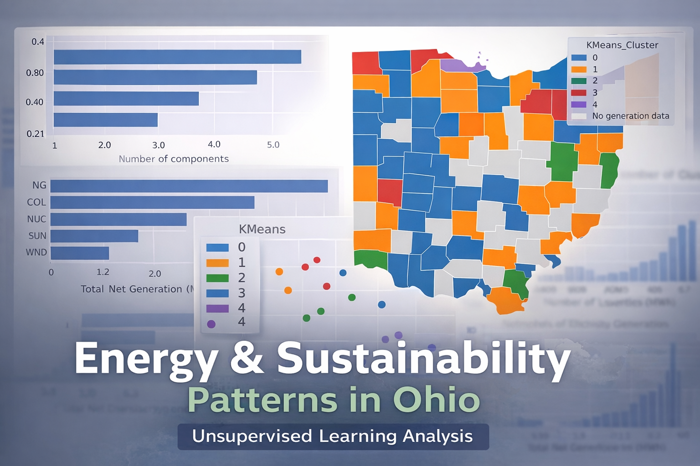
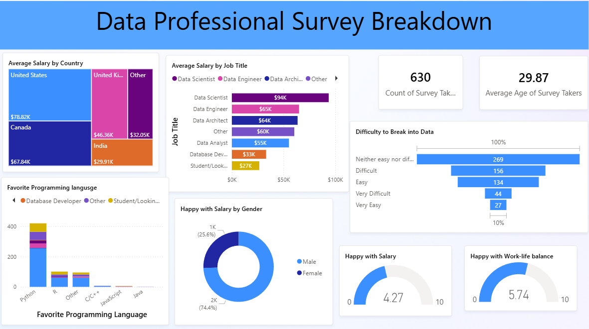
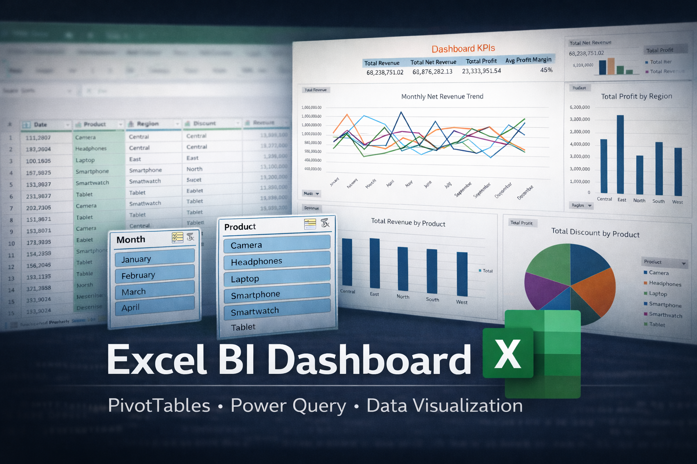

  <aside class="sidebar">
    <h2>Quick jumps</h2>
    <a href="#amazon-product-recommendation-system">Amazon Product Recommendation System </a>
    <a href="#ohio_energy_composition_unsupervised_analysis">Ohio Energy Composition Analysis (Unsupervised Learning) </a>
    <a href="#ohio-housing-affordability-analysis-powerbi">Ohio Housing Affordability Analysis (Power BI) </a>
    <a href="#foodhub-customer-and-business-analytics">FoodHub Customer & Operations Analytics </a>
    <a href="#power-bi-interactive-dashboard">Power BI Interactive Dashboard (Guided Build)</a>
    <a href="#excel-bi-dashboard">Excel Business Intelligence Dashboard </a>
    <a href="#tourism-attractions-capping-numbers">Tourism Attractions Capping Numbers </a>
    <a href="#a-stochastic-version-of-a-competing-species-model">A Stochastic Version of a Competing Species Model</a>
  </aside>

  

# Selected Projects

---
## Amazon Product Recommendation System {#amazon-product-recommendation-system}
This project develops and evaluates a recommendation system using Amazon product review data. Multiple recommendation strategies are explored, including popularity-based methods and collaborative filtering. A matrix factorization approach using Singular Value Decomposition (SVD) is implemented to learn latent user–item relationships and generate personalized recommendations. Model performance is evaluated using both prediction and ranking metrics such as RMSE, Precision@k, Recall@k, and F1-score@k.

🔗 [Notebook & repository on GitHub](https://github.com/SARAH-GAKII/amazon-product-recommendation-system/blob/main/Amazon_Product_Recommendation_System.ipynb) 

#### Tools and technologies
Python, pandas, NumPy, scikit-learn, Surprise, Collaborative Filtering, Matrix Factorization (SVD), Precision@k, Recall@k, F1-score@k, RMSE, Matplotlib, Seaborn 

---

## Ohio Energy Composition Analysis (Unsupervised Learning) {#ohio_energy_composition_unsupervised_analysis}

This project applies unsupervised learning to explore county-level electricity generation patterns across Ohio using publicly available U.S. Energy Information Administration (EIA) data.  
Rather than predicting outcomes, the focus is on discovering structure, identifying energy-generation archetypes, and assessing whether meaningful groupings emerge across counties.

🔗 [Repository & full analysis on GitHub](https://github.com/SARAH-GAKII/ohio-energy-composition-unsupervised-learning/blob/main/ohio_energy_composition_unsupervised_analysis.ipynb) 

#### Project Focus  
Ohio’s energy landscape is highly heterogeneous, with generation dominated by different fuel sources. Statewide summaries can mask these differences. This analysis investigates whether counties naturally cluster based on energy composition.

#### Methodology  
- Merged EIA-923 generation data with EIA-860 plant metadata  
- Aggregated plant-level data to the county level  
- Engineered fuel-share features (normalized energy composition per county)  
- Applied feature scaling to support distance-based methods  
- Used PCA to assess intrinsic dimensionality and dominant variance directions  
- Used t-SNE for neighborhood-level visualization  
- Performed clustering using:
  - K-Means  
  - K-Medoids  
  - Hierarchical Clustering (Ward linkage)  
- Validated cluster structure using inertia, silhouette scores, dendrogram, and cophenetic correlation

  

#### Key Insights  
- Ohio counties consistently separate into five energy archetypes:
  - Renewables-dominant  
  - Natural-gas-dominant  
  - Coal-dominant  
  - Nuclear-dominant  
  - Mixed-profile  
- Cluster structures are stable across all three clustering methods, indicating robust underlying patterns.  
- Energy generation is highly concentrated geographically, with many counties relying almost entirely on a single dominant fuel source.

#### Tools & Techniques  
Python, pandas, NumPy, scikit-learn, scikit-learn-extra, PCA, t-SNE, K-Means, K-Medoids, Hierarchical Clustering, GeoPandas, Matplotlib, Seaborn

---

## Ohio Housing Affordability Analysis (Power BI) {#ohio-housing-affordability-analysis-powerbi}

An interactive Power BI dashboard analyzing housing affordability across Ohio counties (2019–2023) using U.S. Census American Community Survey (ACS) data.  
This project was motivated by my volunteer experience with Habitat for Humanity, and demonstrates how county-level data reveals affordability patterns hidden by statewide averages.

🔗 [View the project on GitHub](https://github.com/SARAH-GAKII/Ohio-Housing-Affordability-2019-2023-PowerBI-Project) 

### Focus & Questions
- How have rent, income, and affordability evolved across Ohio counties over time?
- Where does Sandusky County sit relative to neighboring counties and statewide benchmarks?
- Do rising rents translate into higher rent burden, or is income growth offsetting costs?

### Tools & Skills Demonstrated
- Power BI data modeling and DAX measures  
- Time-series and benchmark analysis  
- Geographic visualization (county-level mapping)  
- Translating real-world housing data into policy-relevant insights  

### Key Components
- Statewide overview of rent, income, home values, and rent-to-income ratios  
- County-level comparison highlighting dispersion and regional variation  
- Sandusky County deep dive with benchmark comparisons (Ohio average, 75th percentile)  
- Temporal trends (2019–2023) showing stability and shifts in affordability pressure

<video
  autoplay
  muted
  loop
  playsinline
  preload="metadata"
  style="width:70%; border-radius:12px;"
>
  <source src="/assets/ohio-housing-powerbi-demo.mp4" type="video/mp4">
</video>

### Analytical Highlights
- Ohio’s average rent-to-income ratio remains moderate (~15–16%), masking substantial county-level variation  
- Sandusky County consistently ranks near the middle of Ohio counties, below high-burden benchmarks  
- Rising rents have largely been offset by income growth at the statewide level, though localized pressures persist 

---

## FoodHub Customer & Business Analytics {#foodhub-customer-and-business-analytics}

### Project Overview  
This project analyzed customer behavior, pricing dynamics, and operational efficiency within an online food delivery platform. Using a real-world transactional dataset, I examined how order value, cuisine type, delivery logistics, and customer feedback influence platform revenue and service performance.

🔗 [View the Project on Olympus eportfolio](https://olympus.mygreatlearning.com/eportfolio) 

### Data & Tools 
- **Dataset:** A real-world food delivery orders dataset
- **Programming:** Python  
- **Libraries:** Pandas, NumPy, Matplotlib, Seaborn  

### Methodology  
- Analyzed a real-world food delivery dataset using Python libraries to study customer behavior, pricing patterns, ratings bias, and operational performance.
- Performed data cleaning, missing-value handling, exploratory, and multivariate data analysis to study pricing distributions, demand concentration, delivery and preparation times, and cuisine-level trends.
- Applied correlation analysis and segmentation techniques to investigate relationships between operational metrics and customer behavior.
- Implemented a rule-based revenue model in Python to estimate platform earnings and delivered data-driven recommendations on staffing, promotions, and revenue optimization.

### Key Insights  
- High-value orders contributed a disproportionate share of platform revenue despite representing a minority of total orders.  
- Delivery time variability, rather than food preparation time, emerged as the primary operational bottleneck.  
- Customer ratings were heavily skewed toward high values, with many orders left unrated, suggesting that feedback did not fully represent all customer experiences.
- Weekend demand consistently exceeded weekday demand, suggesting opportunities for targeted staffing and promotions.

### Outcome  
This project demonstrates how Python-based analytics can translate raw operational data into actionable insights for revenue optimization, logistics planning, and customer engagement.

*Note: This project was completed as part of a supervised academic program. A curated portfolio version will be linked later, but I am happy to discuss the analysis, methodology, and insights in more detail upon request.*

---

## Power BI Interactive Dashboard (Guided Build) {#power-bi-interactive-dashboard}

Built an interactive Power BI report to practice industry-standard BI workflows using a real-world dataset collected through a survey. The project was developed as a guided implementation following Alex The Analyst’s Power BI tutorial series.

[View the project on GitHub](https://github.com/SARAH-GAKII/powerbi-guided-dashboard-project)

- Cleaned and transformed survey-based data using Power Query, addressing formatting and consistency issues common in real-world inputs.
- Designed a structured data model with relationships to support reliable slicing and filtering.
- Developed DAX measures to power KPIs and dynamic aggregations across report views.
- Built an interactive dashboard with slicers, cross-filtering, and drilldowns to support exploratory analysis.

This project highlights my ability to work with real-world data and translate it into interactive, model-driven business intelligence insights.

---

## Excel Business Intelligence Dashboard {#excel-bi-dashboard} 

Developed a full Excel-based Business Intelligence dashboard to demonstrate advanced data analysis and visualization skills. The project transformed raw financial data into actionable insights.  

🔗 [View the project on GitHub](https://github.com/SARAH-GAKII/Excel-Business-Intelligence-Dashboard-From-Raw-Data-to-Insight./tree/main) 

-	Developed an end-to-end Excel-based BI dashboard using PivotTables, PivotCharts, slicers, and calculated fields to analyze multi-dimensional financial data.
-	Built dynamic KPI panels and trend analyses for revenue, profit, and margins across products, regions, and months.
-	Transformed raw financial data into an interactive decision-support tool for performance monitoring and strategic insights.
-	Developed novel numerical algorithms; applied computational modeling to nonlinear boundary problems. 
  

This project showcases my ability to take raw datasets and build a tool that supports decision-making and business insights.   

---

## Tourism Attractions Capping Numbers  

At the Mathematics in Industry Study Group (MISG 2023), I worked with a team tackling a problem brought forward by an industry representative: how to determine fair and effective visitor caps for tourism attractions. This was an open-ended challenge with direct implications for resource management, sustainability, and economic planning.  

#### Context  
Tourism attractions often face the tension between maximizing revenue and preserving visitor experience and environmental sustainability. Setting a cap on visitor numbers is a practical necessity, but determining those caps requires careful balancing of variables such as attraction size, environmental impact, peak demand, and operating costs.  

#### Exploration  
Working as part of a group, I helped to:  
- Translate the industry question into a mathematical modeling problem.  
- Discuss assumptions and constraints, such as visitor flow, carrying capacity, and cost-benefit trade-offs.  
- Explore initial model formulations, which aimed to capture the dynamics of attraction use and guide optimal capping strategies.  

#### Reflection  
This project was a valuable opportunity to apply mathematical thinking to a live industry problem. It strengthened my skills in:  
- Problem formulation in open-ended, real-world contexts.  
- Team-based research under tight deadlines.  
- Communicating technical approaches to both academic and industry audiences.

---

## A Stochastic Version of a Competing Species Model  

During the Mfano Africa – Oxford Mathematics Virtual Mentorship Programme (2022), I completed a mini research project under the mentorship of Dr. Robert A. McDonald, exploring mathematical models of species competition.  

#### Context  
The project examined the competition between native red squirrels and invasive grey squirrels in the UK. Grey squirrels carry the squirrelpox virus, which is harmless to them but fatal to red squirrels, contributing to the decline of red squirrel populations. We sought to study these dynamics through mathematical modeling.  

#### Methodology  
- Constructed a system of ordinary differential equations (ODEs) to describe red–grey squirrel competition based on the competitive exclusion principle.  
- Analyzed the system to determine long-term outcomes depending on initial population sizes.  
- Implemented and visualized the ODE simulations using MATLAB.  
- Outlined how a stochastic extension could provide additional ecological realism, highlighting expected outcomes.  

#### Findings  
- The ODE-based model confirmed the competitive exclusion principle: two species with identical niches cannot coexist indefinitely.  
- Simulations showed that initial conditions strongly influence survival: whichever species begins with an advantage tends to dominate.  
- Highlighted that randomness in a stochastic model could delay or modify extinction outcomes, offering a natural direction for future research.  

#### Reflection  
This project strengthened my ability to translate ecological principles into dynamical systems models, perform computational simulations, and present technical findings in an international mentorship setting.  

**Mentor:** Dr. Robert A. McDonald  

    
  

